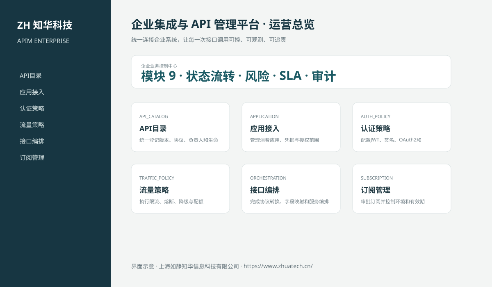

# ZhuaTech APIM｜企业集成与 API 管理平台

> 统一连接企业系统，让每一次接口调用可控、可观测、可追责

ZhuaTech APIM 是知华科技（上海如静知华信息科技有限公司）发布的企业级源码项目，面向“API资产、应用接入、鉴权、流量策略、编排、订阅、监控、告警与审计”提供管理端与响应式业务端。工程采用前后端分离架构，所有示例数据均为虚构数据。

[知华科技官网](https://www.zhuatech.cn/) · [架构说明](docs/ARCHITECTURE.md) · [API 文档](docs/API.md) · [企业能力](docs/ENTERPRISE.md) · [测试说明](docs/TESTING.md)



## 业务模块

| 模块 | 核心能力 |
| --- | --- |
| API目录 | 统一登记版本、协议、负责人和生命周期 |
| 应用接入 | 管理消费应用、凭据与授权范围 |
| 认证策略 | 配置JWT、签名、OAuth2和IP白名单 |
| 流量策略 | 执行限流、熔断、降级与配额 |
| 接口编排 | 完成协议转换、字段映射和服务编排 |
| 订阅管理 | 审批订阅并控制环境和有效期 |
| 运行监控 | 跟踪成功率、延迟、错误码和依赖 |
| 告警处置 | 告警分派、升级和复盘 |
| 调用审计 | 保留调用、策略变更与管理员操作证据 |


## 企业级控制

- ADMIN / OPERATOR 角色边界和管理员接口隔离；
- 服务端字段、模块、唯一编号和状态迁移校验；
- 组织、期间、责任人、风险等级、到期日和 SLA 统计；
- 幂等创建、JPA 乐观锁、重复提交保护和职责分离；
- 附件 SHA-256 元数据、业务凭证完整性与全流程审计；
- 组合检索、分页、逾期筛选、UTF-8 CSV 导出和协作时间线；
- 外部系统仅预留适配器，使用方自行配置地址与凭据；
- prod profile 拒绝默认密码、弱数据库口令和本地跨域来源。

## 技术架构

- 后端：Java 21、Spring Boot、Spring Security、JPA、Bean Validation、Actuator
- 前端：Vue 3、Vite、Axios，支持桌面端与移动端响应式布局
- 数据库：MySQL 8；自动化测试使用 H2
- 交付：Docker Compose、Nginx、环境变量、GitHub Actions
- Java 包名：`cn.zhuatech.apimanagement`

## 启动与测试

```bash
cd backend && mvn test
cd ../frontend && npm install && npm run build
cd .. && cp .env.example .env && docker compose up --build
```

开发演示账号：`admin / admin123`、`operator / operator123`。生产环境必须通过环境变量替换全部默认凭据。

## API 版本发布治理

新增 API 上线前的企业发布门禁，统一校验 OpenAPI 契约、认证授权、敏感数据、限流配额、安全扫描、破坏性变更迁移和回滚准备。详见[企业 API 发布门禁](docs/ENTERPRISE_API_PUBLICATION.md)。

## 许可与商业授权

Copyright © 2026 上海如静知华信息科技有限公司。

本工程仅允许个人学习、研究和非商业技术交流，**不得用于商业用途**。企业内部使用、生产部署、SaaS运营、项目交付、品牌替换、收费培训、咨询实施或再分发，均须事先获得上海如静知华信息科技有限公司书面授权，详见 [LICENSE](LICENSE)。

深度开发、私有化部署、系统集成与企业数字化咨询，请访问[知华科技官网](https://www.zhuatech.cn/)或扫码联系：

| 微信咨询一 | 微信咨询二 |
| --- | --- |
|  |  |

SEO：企业集成与 API 管理平台、APIM系统源码、企业数字化、Java企业系统、Vue管理系统、知华科技、上海如静知华信息科技有限公司。

## V2.0 专业领域能力

新增API版本资产、消费应用、订阅审批和调用时间窗指标模型。发布前强制认证与限流策略，生产订阅需要管理员审批；运行指标计算成功率、P95延迟和健康等级。专业工作台入口为“专业业务中心”，API 根路径为 `/api/apim`。
